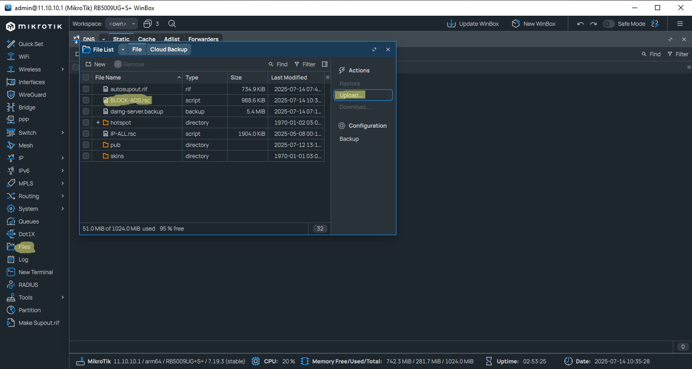
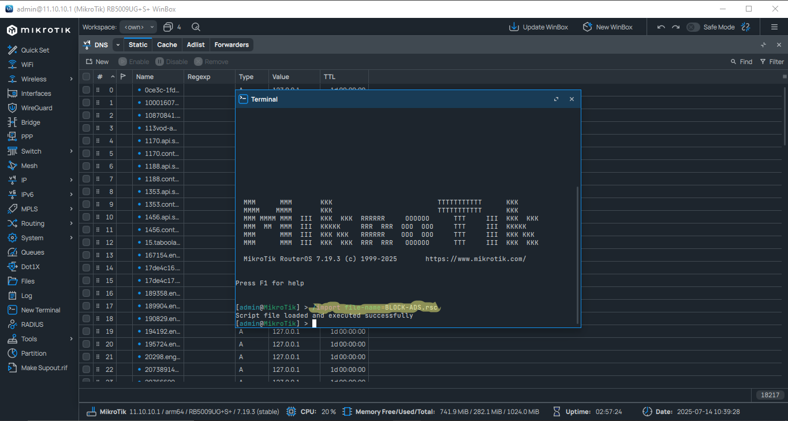
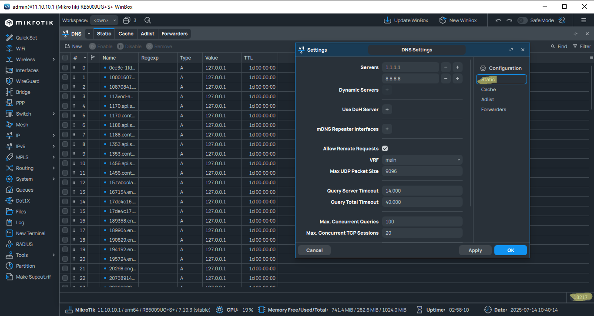

<h1 align="center">🔞 BLOCK-PORN – مشروع لحظر المواقع الإباحية على MikroTik</h1>

  مشروع مفتوح المصدر يهدف إلى حظر المواقع الإباحية بالكامل باستخدام MikroTik DNS. يوفر حماية فعالة وسهلة للمستخدمين من المحتوى الضار والمخالف، مع دعم كامل للتحديث والتكامل السلس 🛡️

<h2>🎯 أهداف المشروع</h2>

<ul>
  <li>🚫 حظر المواقع الإباحية بشكل كامل عبر DNS</li>
  <li>👨‍👩‍👧‍👦 حماية الأطفال والعائلات من الوصول غير المرغوب فيه للمحتوى السيء</li>
  <li>⚡ تقليل استهلاك البيانات وتحسين سرعة التصفح</li>
  <li>📦 توفير نسخ مختلفة للقوائم حسب الحاجة (شاملة ومخففة)</li>
  <li>🔁 إمكانية تحديث القوائم بشكل دوري تلقائيًا</li>
</ul>

<h2>📂 هيكلية المشروع</h2>

<ul>
  <li><strong>BLOCK-PORN-M-H.rsc</strong> – قائمة شاملة لحظر المواقع الإباحية (تتضمن آلاف النطاقات)</li>
  <li><strong>BLOCK-PORN-L.rsc</strong> – قائمة خفيفة للحظر الأساسي دون التأثير على التصفح العام</li>
  <li><strong>dns-sources</strong> – مصادر موثوقة يتم استخراج الدومينات منها (AdGuard, DNSFilter, وغيرها)</li>
</ul>

<h2>✅ مميزات المشروع</h2>

<ul>
  <li>🔐 لا حاجة لتثبيت برامج إضافية – يعمل عبر MikroTik مباشرة</li>
  <li>⚙️ متوافق مع RouterOS 6/7</li>
  <li>🧼 يمنع الاتصال بالمواقع مباشرة عن طريق إعادة التوجيه لـ 127.0.0.1</li>
  <li>📄 صيغة جاهزة للاستيراد المباشر</li>
</ul>

<h2>🛠️ طريقة الاستخدام</h2>

<ol>
  <li>افتح <strong>Winbox</strong> أو <strong>WebFig</strong></li>
  <li>اذهب إلى قسم <strong>Files</strong> وارفع أحد الملفات التالية:</li>
</ol>

<pre><code>/import file-name=BLOCK-PORN-M-H.rsc</code></pre>
<pre><code>/import file-name=BLOCK-PORN-L.rsc</code></pre>

<ol start="3">
  <li>إذا رغبت في حذف جميع الإدخالات السابقة:</li>
</ol>

<pre><code>/ip dns static remove [find]</code></pre>

✅ لا حاجة لإعادة تشغيل الجهاز – يتم تطبيق القواعد فورًا.

<h2>🖼️ صور توضيحية من داخل المشروع</h2>

<table style="border-collapse: separate; border-spacing: 20px;">
  <tr>
    <td align="center" style="background-color: #f0f8ff; padding: 15px; border-radius: 12px; box-shadow: 0 0 10px rgba(0,0,0,0.1);">
      <strong style="color: #007acc;">🔹 رفع الملف</strong> 
      
    </td>
    <td align="center" style="background-color: #fff0f5; padding: 15px; border-radius: 12px; box-shadow: 0 0 10px rgba(0,0,0,0.1);">
      <strong style="color: #cc3366;">🔹 تنفيذ أمر الاستيراد</strong> 
      
    </td>
    <td align="center" style="background-color: #f5fff0; padding: 15px; border-radius: 12px; box-shadow: 0 0 10px rgba(0,0,0,0.1);">
      <strong style="color: #228b22;">🔹معلومات إضافية</strong> 
      
    </td>
  </tr>
</table>

---

## 📄 الرخصة

هذا المشروع مفتوح المصدر ومتاح للاستخدام وفق شروط رخصة خاصة مبنية على MIT، تمت كتابتها باللغة العربية لتكون أوضح للمستخدمين.

⚠️ **يرجى احترام حقوق المؤلف وعدم نشر تعديلات تسيء إلى جودة أو سمعة المشروع.**  
📌 يجب دائمًا ذكر اسم المؤلف: **علي حسين (Ali Hussain)** في أي استخدام أو تعديل أو إعادة نشر.

📄 ملف الرخصة الكامل متوفر هنا: [LICENSE](./LICENSE)

<h2>📬 انضم إلى مجتمعنا على تيليجرام</h2>

  

  💬 شارك معنا في تطوير المشروع، تابع التحديثات، واطلب الدعم الفني مباشرة.

