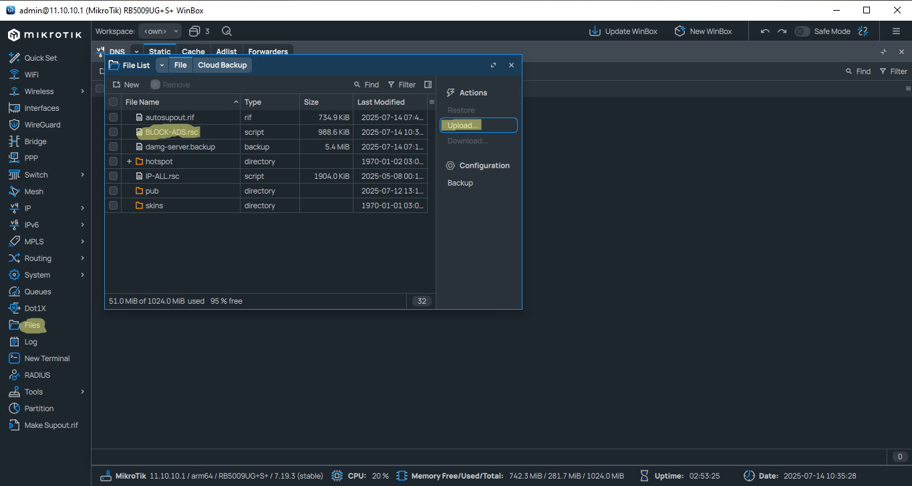
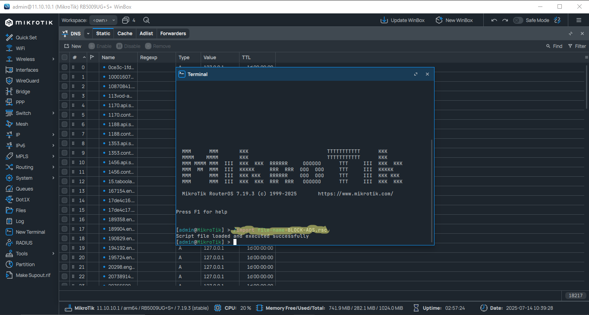
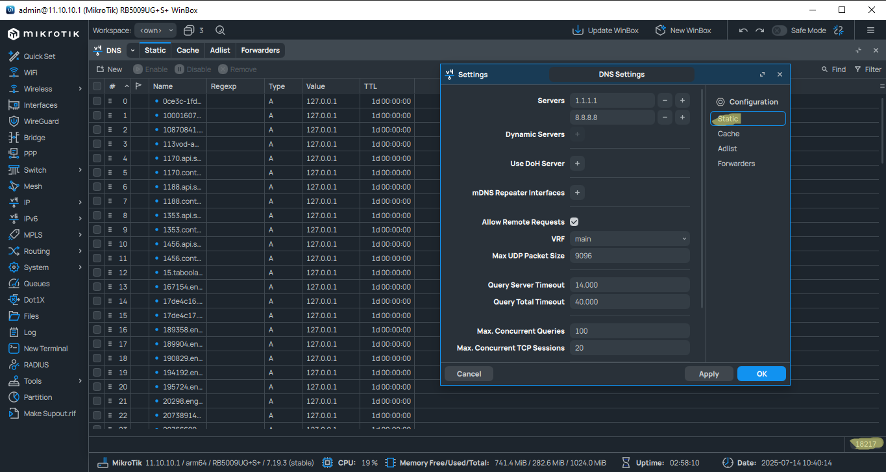

<h1 align="center">🚫 MIKROTIK-ADS – مشروع متكامل لحظر الإعلانات على MikroTik</h1>

  مشروع مفتوح المصدر يهدف إلى حظر الإعلانات الخارجية عبر أجهزة MikroTik باستخدام نظام DNS مخصص. يتميز بالبساطة، والأداء العالي، وسهولة التثبيت 💪

<h2>🎯 أهداف المشروع</h2>

<ul>
  <li>✳️ توفير حلول فعالة وجاهزة لحظر الإعلانات</li>
  <li>📡 تحسين تجربة التصفح وتقليل استهلاك البيانات</li>
  <li>🧱 دعم كامل لأجهزة MikroTik بنظام RouterOS 7+</li>
  <li>🤝 تطوير ومتابعة مستمرة من فريق مختص</li>
  <li>🔧 تحديثات دورية وتحسينات جماعية</li>
</ul>

<h2>📂 هيكلية المشروع</h2>

<ul>
  <li><strong>block-ads</strong> – قائمة DNS لحظر أكثر من 99% من الإعلانات الخارجية</li>
  <li><strong>youtube-ads-block</strong> – قواعد مخصصة لحظر إعلانات يوتيوب (النسبة متفاوتة ولكن فعالة)</li>
  <li><strong>dns-sources</strong> – مصادر موثوقة يتم الاعتماد عليها لتوليد القوائم</li>
  <li><strong>auto-update-script</strong> – سكريبتات لتحديث القوائم تلقائيًا</li>
</ul>

<h2>✅ مميزات المشروع</h2>

<ul>
  <li>🔐 ملفات نظيفة وخالية من الأخطاء</li>
  <li>⚙️ خفيف ولا يؤثر على أداء الشبكة</li>
  <li>🧼 تركيز خاص على إعلانات Google وسيرفراتها</li>
  <li>📄 لا يشمل حظر المحتوى الإباحي – فقط الإعلانات</li>
</ul>

<h2>🛠️ طريقة الاستخدام</h2>

<ol>
  <li>افتح <strong>Winbox</strong> أو <strong>WebFig</strong></li>
  <li>اذهب إلى قسم <strong>Files</strong> وارفع ملف <code>block-ads.rsc</code></li>
  <li>افتح <strong>Terminal</strong> ونفذ الأمر التالي:</li>
</ol>

<pre><code>/import file-name=block-ads.rsc</code></pre>

✅ سيتم تطبيق الإعدادات تلقائيًا دون الحاجة لإعادة تشغيل الجهاز.

<h2>🖼️ صور توضيحية من داخل المشروع</h2>

<table style="border-collapse: separate; border-spacing: 20px;">
  <tr>
    <td align="center" style="background-color: #f0f8ff; padding: 15px; border-radius: 12px; box-shadow: 0 0 10px rgba(0,0,0,0.1);">
      <strong style="color: #007acc;">🔹 رفع الملف داخل MikroTik</strong> 
      
    </td>
    <td align="center" style="background-color: #fff0f5; padding: 15px; border-radius: 12px; box-shadow: 0 0 10px rgba(0,0,0,0.1);">
      <strong style="color: #cc3366;">🔹 تنفيذ أمر الاستيراد</strong> 
      
    </td>
    <td align="center" style="background-color: #f5fff0; padding: 15px; border-radius: 12px; box-shadow: 0 0 10px rgba(0,0,0,0.1);">
      <strong style="color: #228b22;">🔹معلومات اضافية </strong> 
      
    </td>
  </tr>
</table>

<h2>📬 Join Our Telegram Community</h2>

  

  💬 تابع التحديثات، اطرح الأسئلة، وشارك في تطوير أدوات حظر الإعلانات معنا.

