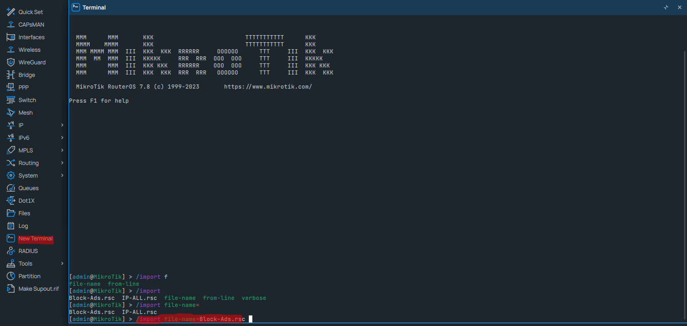
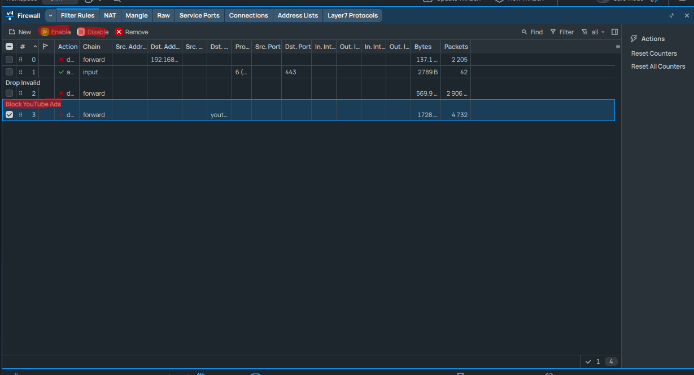

مشروع متكال لحضر الاعلانات على المايكروتك
🚫 block-ads – أداة لحظر الإعلانات الخارجية
🧠 لمحة عامة:
block-ads هو مشروع مطوّر لحظر الإعلانات الخارجية بكفاءة عالية جدًا، مستوحى بالكامل من نظام DNS الشهير السابق، وتم تعديله وتحسينه بشكل شخصي واحترافي لضمان أعلى أداء واستقرار.
تمت إعادة بنائه ليكون بديلًا قويًا ومتكاملًا 💪

🎯 مميزات المشروع:
🌐 نسبة حظر المواقع والإعلانات الخارجية تتجاوز 99%

🎥 حظر إعلانات يوتيوب: النسب غير دقيقة لأنها تعتمد على عدة عوامل، لكنها جيدة جدًا حسب التجارب الحالية

🧱 مبني بالكامل على نظام DNS دون الحاجة إلى برامج أو إضافات خارجية

🧼 يركّز بشكل خاص على حظر إعلانات Google وسيرفراتها

🔐 لا يشمل حظر المحتوى الإباحي – تركيزه فقط على الإعلانات

🧪 الملف سليم 100% وتم اختباره بدقة

✨ لا يؤثر على تجربة المستخدم ولا يسبب أي إزعاج أو بطء

📎 استخدام مقترح:
⚙️ يمكن استخدام الملف مباشرة مع:

MikroTik (الإصدار 7 فما فوق)
✅ تم تصميم الملف خصيصًا لهذه البيئة، ولم يُستوحَ من أنظمة أخرى – بل هو تطوير وتصميم شخصي بالكامل لضمان الكفاءة القصوى.


🛠️ طريقة الاستخدام:
🔼 ارفع الملف إلى المايكروتك:

افتح Winbox أو WebFig

انتقل إلى تبويب Files

اسحب الملف Block-Ads.rsc أو اضغط على Upload واختره

💻 استدعِ الملف بالأمر التالي:

افتح Terminal

اكتب الأمر التالي:
/import file-name=Block-Ads.rsc

bash
Copy
Edit
import file-name=block-ads.rsc
✅ سيتم تطبيق الإعدادات تلقائيًا

ℹ️ ملاحظات:
تأكد أن اسم الملف هو نفسه block-ads.rsc

لا حاجة لإعادة تشغيل الجهاز بعد التنفيذ

يفضل أخذ نسخة احتياطية قبل الاستيرا
اي تحديثات مستقبلية سيتم تطبيقها على هذا المشروع او اضفتها ضمن هذا المشروع

---

# 🚫 MIKROTIK-ADS – حلول متكاملة لحظر الإعلانات باستخدام MikroTik

## 🧠 لمحة عامة:
`MIKROTIK-ADS` هو مشروع مطوّر لحظر الإعلانات الخارجية بكفاءة عالية جدًا، مستوحى من نظام DNS الشهير السابق، وتم تعديله وتحسينه بشكل شخصي واحترافي لضمان أعلى أداء واستقرار.  
تمت إعادة بنائه ليكون بديلًا قويًا ومتكاملًا 💪

---

## 🎯 الهدف من المشروع:

- ✳️ تقديم حلول متكاملة ومفتوحة المصدر لحظر الإعلانات
- 📡 تحسين تجربة التصفح وتقليل استهلاك البيانات
- 🧱 دعم MikroTik RouterOS 7+
- 🤝 تطوير جماعي بإشراف مباشر من مختصين لضمان الجودة
- 🔧 تحديثات مستمرة وتطوير تدريجي

---

## 📂 محتويات المشروع:

- `block-ads` – قائمة DNS لحظر الإعلانات الخارجية
- `youtube-ads-block` – قواعد لحظر إعلانات YouTube (نسبة الحظر جيدة)
- `dns-sources` – مصادر للقوائم المعتمدة
- `auto-update-script` – سكريبت لتحديث القوائم تلقائيًا

---

## ✅ مميزات:

- 🔐 ملفات نظيفة وخالية من الأخطاء
- ⚙️ سهلة التثبيت ولا تؤثر على أداء الشبكة
- 🧼 تركيز خاص على حظر إعلانات Google وسيرفراتها
- 📄 لا تشمل المحتوى الإباحي – فقط الإعلانات

---

## 🛠️ طريقة الاستخدام (MikroTik 7+):

1. 🔼 **رفع الملف إلى MikroTik:**
   - افتح Winbox أو WebFig
   - انتقل إلى **Files**
   - ارفع `block-ads.rsc`

2. 💻 **استدعاء الملف:**
   - افتح **Terminal**
   - نفّذ:

     ```bash
     import file-name=block-ads.rsc
     ```

3. ✅ سيتم تطبيق الإعدادات تلقائيًا

---

## 🖼️ صور توضيحية من داخل المشروع


#### 🔹 رفع ملف الحظر داخل MikroTik


#### 🔹 تنفيذ أمر الاستيراد `import`



#### 🔹 تفعيل وتعطيل الحظر


## 📬 انضم إلى مجتمعنا على تيليجرام:

[](https://t.me/star1ink_1raq)

> شارك أفكارك، استفسر، وساهم في تطوير أدوات حظر الإعلانات معنا
